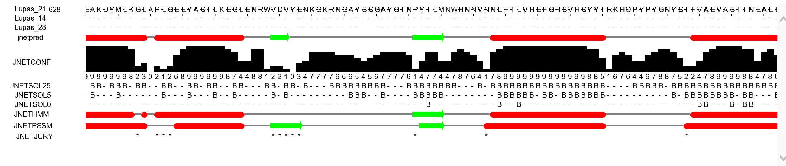
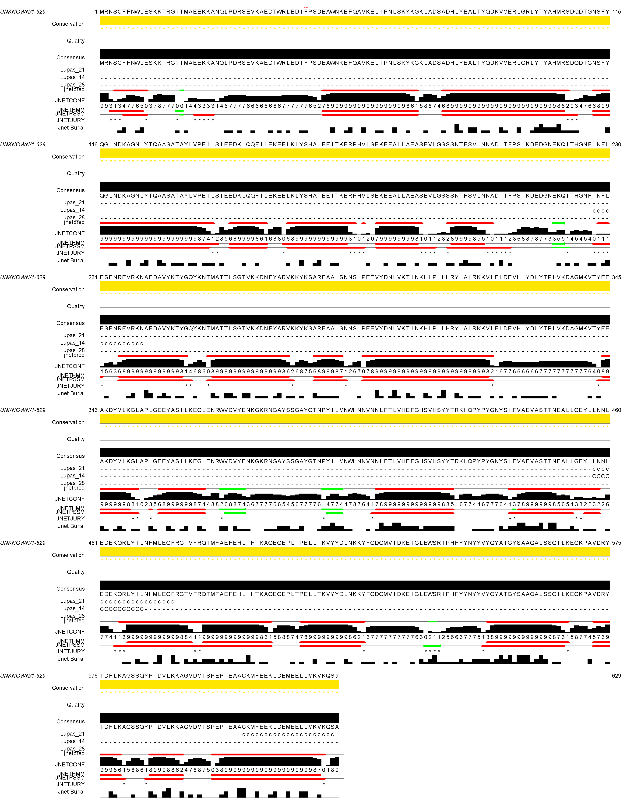
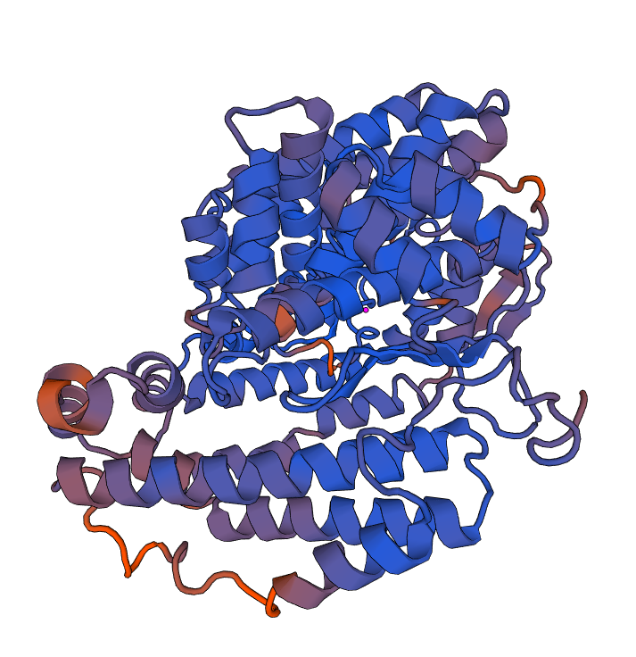

# Bioinformatics Analysis P70922

## Directions 
BINF630/BIOL580/BINF401 Spring 2018.  
Homework 2.   
Due April 26, 2018.  

Select one of the protein sequences from the list below (the first letter of the protein ID should be the same as the first letter of your last name or the closest to it). Predict secondary and three-dimensional structure for the selected sequence using an advanced secondary structure prediction algorithm and a homology modeling algorithm, respectively. Analyze the quality of your model using one of the structure validation or verification tools and identify structural classification of your model. 

[FOR BINF630 AND BIOL580 STUDENTS ONLY: Compare predicted secondary structures with the secondary structures in 3D model.]

Proteins: `A3ZYW9,  D2R8U6,  E8VHH5,   F2B227,  H8FDZ3, G2LWL6,  K8G1J4,  P70922,  Q1N7D2,  Q1NN20,  Q5GY42,  U4M247,  Z4WQ39`
 
Present the results of the modeling with description of all the steps and structure annotation in HTML format with interactive molecular visualization and alignment visualization tools and post the files on your binf webspace. Submit the URL by email with the string "b630_18_hw2" in the message subject line.

## Methods Overview

1. Protein Selected 
    - see [P70922 in fasta](static/P70922.fasta.txt)
2. Secondary structure was predicted with [jpred](http://www.compbio.dundee.ac.uk/jpred/) an advanced secondary structure prediction algorithm
    - see [the jpred results in pdf](jrepd-results/secondary-structure-results.pdf)
    - this was repeated in a [jalview project](static/P70922-jalview.jvp)
3. 3D structure was predicted with [swissmodel](https://swissmodel.expasy.org/), homology-modeling server
    - the results are given in [this report](swiss-model-build/report.html)
    - the results are given in link [swissmodel](https://swissmodel.expasy.org/interactive/tXJyj5/models/)
4. Quality of Model was analyzed with [swissmodel qmean](https://swissmodel.expasy.org/qmean/) 
    - read [qmeans-readme](qmean-results/README) for information on the data export
    - the results are given in link [swissmodel qmean](https://swissmodel.expasy.org/qmean/project/7uXBD3/)
5. html results and description presented in this repository [binf.gmu.edu/lpincus/](http://binf.gmu.edu/lpincus/)


# Results 

## Protein Selection 
"P70922" was searched in [Uniprot](http://www.uniprot.org/). The protein sequance was found. The FASTA file is available at http://www.uniprot.org/uniprot/P70922.fasta

```
>tr|P70922|P70922_BACLI Pz-peptidase OS=Bacillus licheniformis OX=1402 PE=3 SV=1
MRNSCFFNWLESKKTRGITMAEEKKANQLPDRSEVKAEDTWRLEDIFPSDEAWNKEFQAV
KELIPNLSKYKGKLADSADHLYEALTYQDKVMERLGRLYTYAHMRSDQDTGNSFYQGLND
KAGNLYTQAASATAYLVPEILSIEEDKLQQFILEKEELKLYSHAIEEITKERPHVLSEKE
EALLAEASEVLGSSSNTFSVLNNADITFPSIKDEDGNEKQITHGNFINFLESENREVRKN
AFDAVYKTYGQYKNTMATTLSGTVKKDNFYARVKKYKSAREAALSNNSIPEEVYDNLVKT
INKHLPLLHRYIALRKKVLELDEVHIYDLYTPLVKDAGMKVTYEEAKDYMLKGLAPLGEE
YASILKEGLENRWVDVYENKGKRNGAYSSGAYGTNPYILMNWHNNVNNLFTLVHEFGHSV
HSYYTRKHQPYPYGNYSIFVAEVASTTNEALLGEYLLNNLEDEKQRLYILNHMLEGFRGT
VFRQTMFAEFEHLIHTKAQEGEPLTPELLTKVYYDLNKKYFGDGMVIDKEIGLEWSRIPH
FYYNYYVYQYATGYSAAQALSSQILKEGKPAVDRYIDFLKAGSSQYPIDVLKKAGVDMTS
PEPIEAACKMFEEKLDEMEELLMKVKQS
```

## Secondary Structure with Jpred and JalView
Secondary structure for the protein was predicted with 
[JPred](http://www.compbio.dundee.ac.uk/jpred/), an advanced secondary structure prediction algorithm.

In both the secondary structures below 
- Green represents Beta Sheets
- Red represents Alpha Helices
- Black represents unconserved regions

Before programs like swissmodel the secondary structure was used to predict the 3D structure, see [wikipedia.org/wiki/Protein_secondary_structure](https://en.wikipedia.org/wiki/Protein_secondary_structure)




[Jalview](http://www.jalview.org) 
was also used to obtain the same results. 





## 3D Structure Prediction with swissmodel

The 3D structure was predicted with [swissmodel](http://swissmodel.expasy.org/). 
The results are given here: https://swissmodel.expasy.org/interactive/tXJyj5/models/ 

After the protein sequence was searched for the "Build Model" option was selected. The complete output was included in the generated [report](swiss-model-build/report.html)




<script type="text/javascript" src="JSmol.min.js"></script>

<script type="text/javascript">

    var Info = {
        color: "#E8F4FF",
        height: 500,
        width: 500,
        use: "HTML5"
    };

</script>

<script type="text/javascript">

  jmolApplet0 = Jmol.getApplet("jmolApplet", Info);
  Jmol.script(jmolApplet,"background white; load swiss-model-build/model/01/model.pdb; spin on;")

</script>

<a href="javascript:Jmol.script(jmolApplet,'spin on')">spin</a>

<a href="javascript:Jmol.script(jmolApplet,'spin off')">off</a>


## Analyze Quality of Model with QMEAN

- Quality of model was analyzed with swiss model qmean.
https://swissmodel.expasy.org/qmean/project/7uXBD3/model_001/input.pdb

Results of swissmodel qmean: https://swissmodel.expasy.org/qmean/project/7uXBD3/

The 3D results of the "QMEAN"  are included


<script type="text/javascript">

    var Info = {
        color: "#E8F4FF",
        height: 500,
        width: 500,
        use: "HTML5"
    };

</script>

<script type="text/javascript">

  jmolApplet1 = Jmol.getApplet("jmolQMEAN", Info);
  Jmol.script(jmolQMEAN,"background white; load qmean-results/model1/model_model_001/model.pdb; spin on;")

</script>

<a href="javascript:Jmol.script(jmolQMEAN,'spin on')">spin</a>

<a href="javascript:Jmol.script(jmolQMEAN,'spin off')">off</a>


